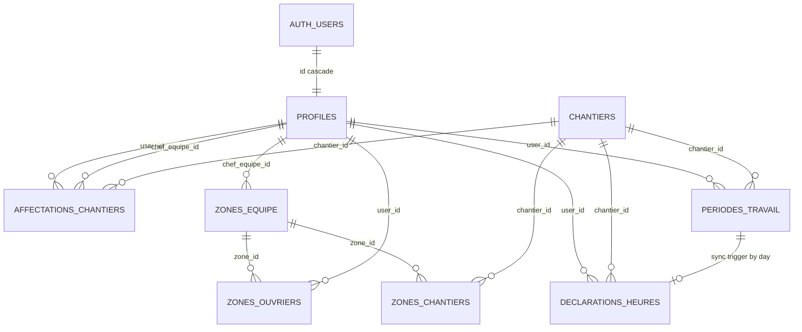
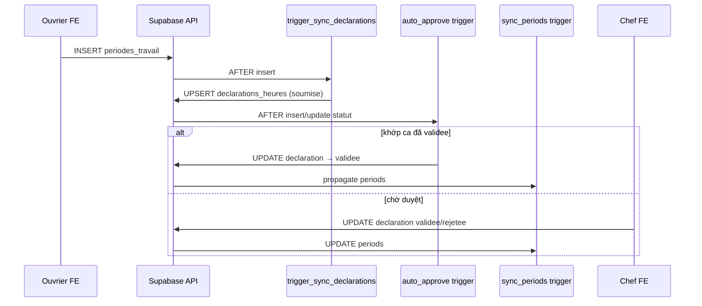
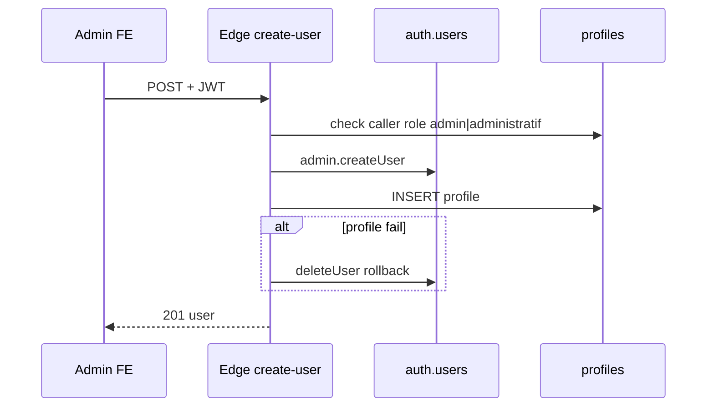
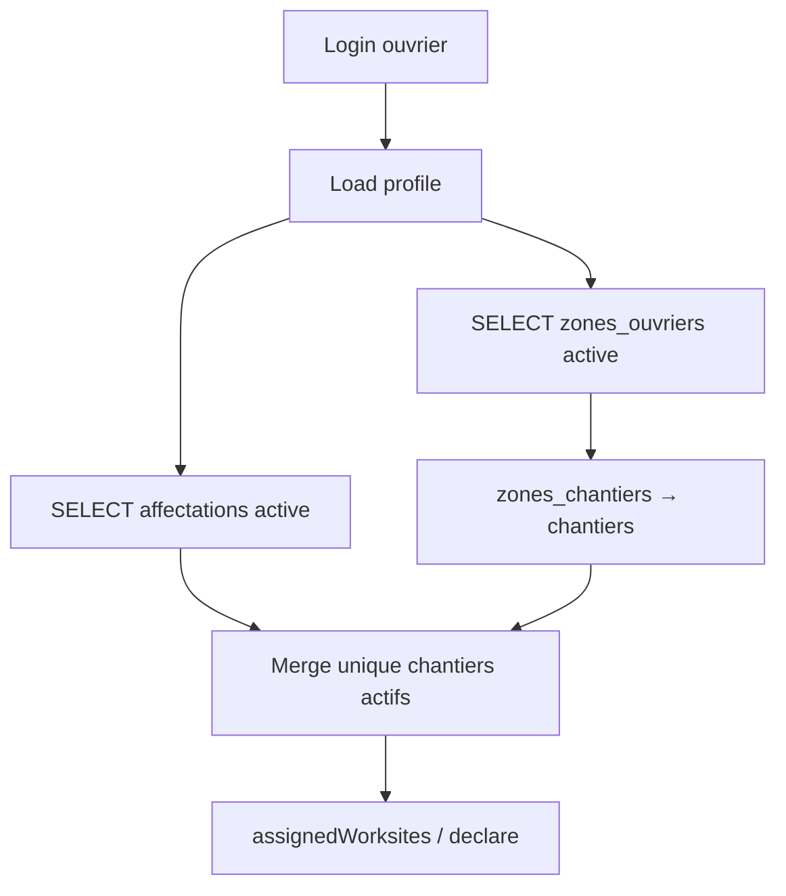
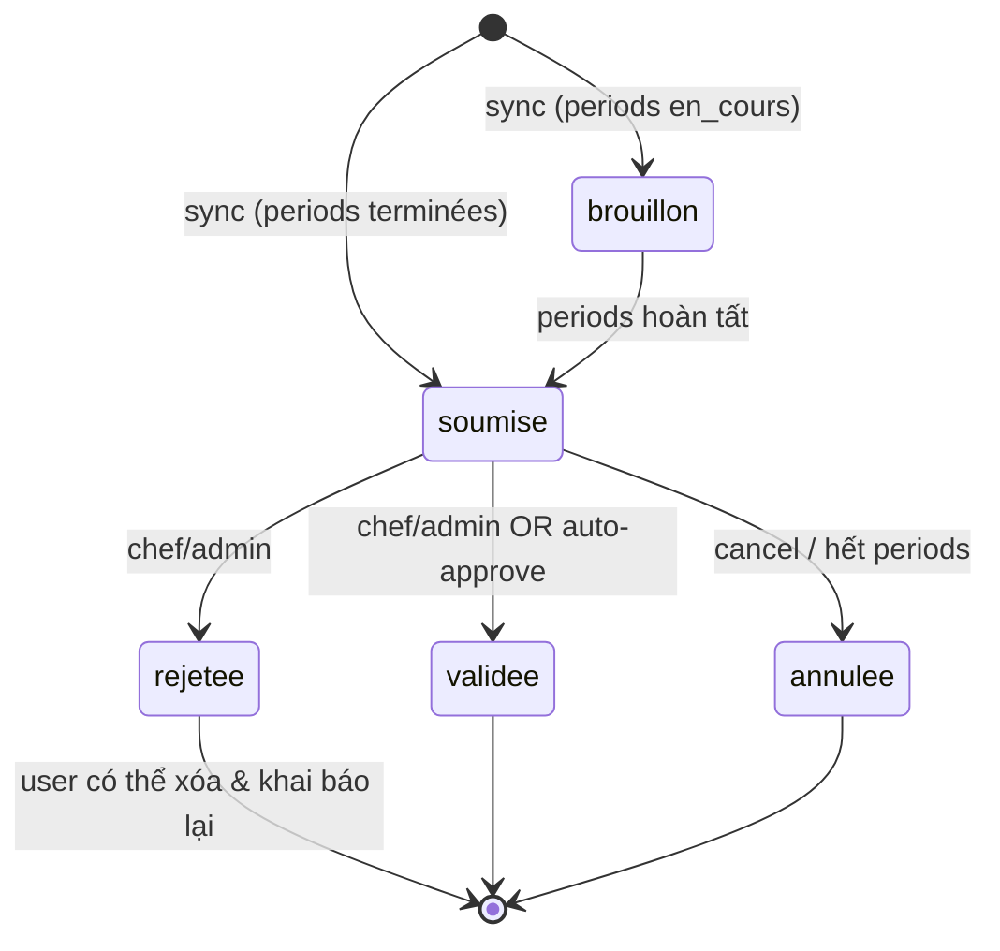
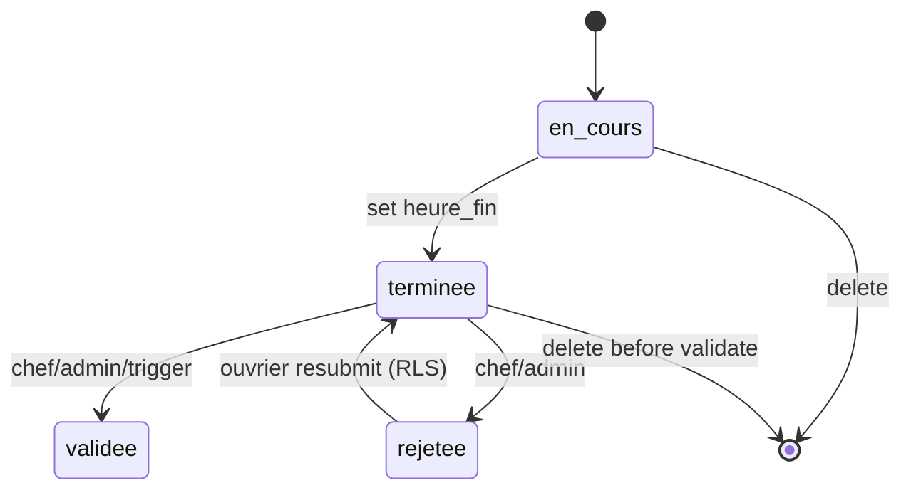
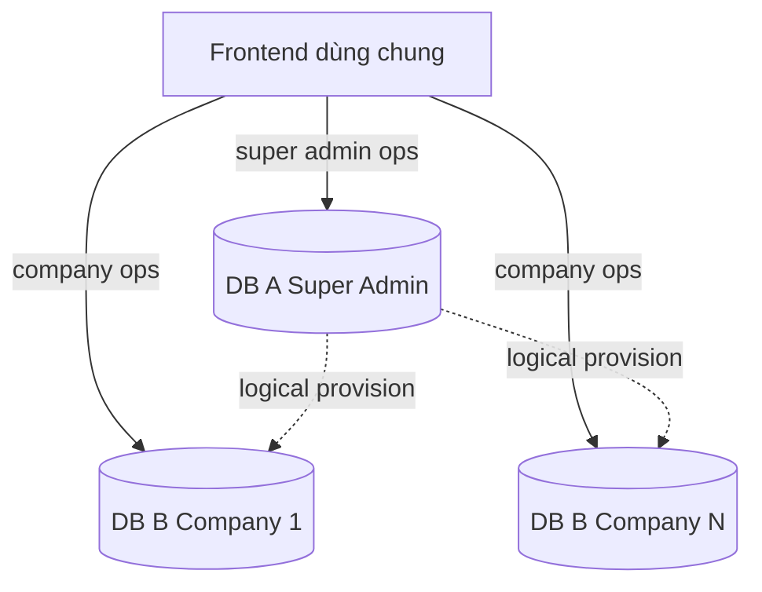

# Diagrams

Các sơ đồ Mermaid phục vụ reverse-engineer. Mở bằng viewer Markdown hỗ trợ Mermaid.

---

## 1. Entity graph (hiện trạng)

File tách: [entity-graph.md](./entity-graph.md)

---

## 2. Sequence — Khai báo giờ → Validate

---

## 3. Sequence — Tạo user

---

## 4. Flowchart — Ai thấy Site nào (Ouvrier)

---

## 5. State — `declarations_heures.statut`

---

## 6. State — `periodes_travail.statut`

---

## 7. Target architecture (brief — chưa có trong code)

Hiện repo chỉ có khối tương đương **một** `DB_B`.
