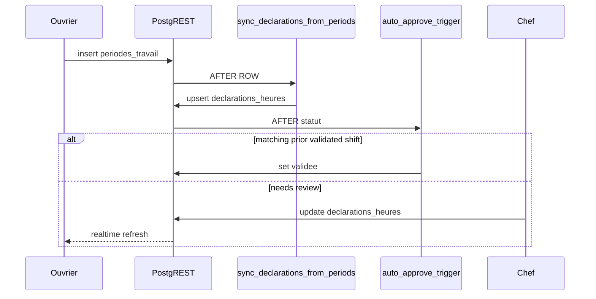

# Sequence — Declare → Validate

```mermaid
sequenceDiagram
  participant O as Ouvrier
  participant API as PostgREST
  participant Sync as sync_declarations_from_periods
  participant Auto as auto_approve_trigger
  participant Chef as Chef

  O->>API: insert periodes_travail
  API->>Sync: AFTER ROW
  Sync->>API: upsert declarations_heures
  API->>Auto: AFTER statut
  alt matching prior validated shift
    Auto->>API: set validee
  else needs review
    Chef->>API: update declarations_heures
    API-->>O: realtime refresh
  end
```
